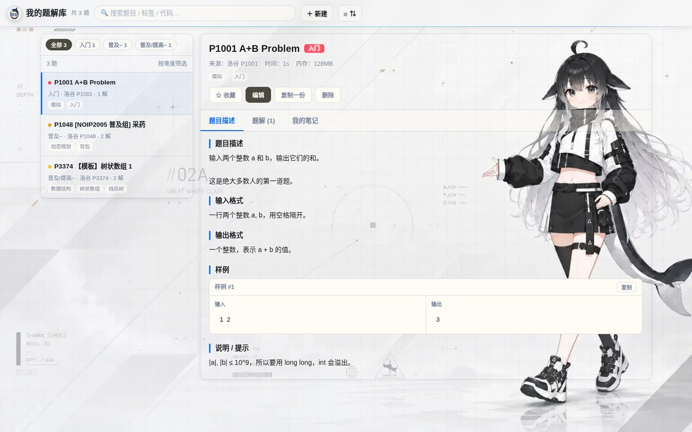

# 我的题解库 · Tiku

一个 **洛谷风格的个人题解库**：把做过的题目、代码和多种题解存在一起，随时回顾。

单个 HTML 文件，**零外部依赖**，双击就能用。电脑上写、手机上看。



---

## 为什么做这个

做完一道题，题解、踩过的坑、以及不同做法的代码，通常散落在洛谷剪贴板、本地 .cpp 文件和聊天记录里。过两个月想回顾，找不到。

这个工具把「题目 + 多种题解 + 个人笔记」放在一个界面里，并且：

- **一题可以挂多份题解**（比如「二维 DP」和「一维滚动数组」并排对比）
- **中文记谱**、难度徽章、标签，沿用洛谷的习惯
- **数据是你的**：存在本地，可导出 JSON；也可以同步到自己的私有 Gist

---

## 功能

### 题库与题解

- 左侧题库栏按 **洛谷七档难度**配色（入门 → NOI/NOI+/CTSC），支持标签与全文搜索
- 搜索范围包括**标题、来源、标签、题目正文、个人笔记、以及题解代码内容**
- 题目页三个标签页：**题目描述** / **题解(N)** / **我的笔记**
- 样例区输入输出并排，可一键复制
- 代码块支持**一键复制**和**下载 .cpp**（文件名按题号自动生成）
- 内置 **C++ 语法高亮**（预处理器、关键字、STL 类型、字符串、数字、注释、函数调用分别着色）
- 收藏、编辑、复制一份、删除

### 从链接导入题目

粘贴一个题目链接，自动填入**题目名、描述、输入输出格式、样例、时空限制**，代码你自己贴。

| 站点 | 解析方式 |
|---|---|
| 洛谷 | 页面内嵌结构化数据，**难度、标签、时空限制、LaTeX 公式全部保留** |
| Codeforces | `.problem-statement` 结构 |
| AtCoder | `#task-statement` 分节 |
| LibreOJ / 牛客 / 自建 OJ | 通用标题分节 |
| 其他任意站点 | 兜底提取标题与正文 |

**为什么要走代理**：浏览器有同源策略，而洛谷等站点不返回 `Access-Control-Allow-Origin`，页面无法直连。因此采用**多通道并发**（allorigins / codetabs / jina / 直连），取最快返回的那个，其余立即中断。

抓不到时，展开「粘贴页面内容」，在题目页 `Ctrl+A` 复制粘贴即可——**解析逻辑完全相同**，所以这条路径永远可用。

### 云端同步

数据默认存在浏览器 `localStorage`，**不同设备之间不会自动同步**。提供三种方式：

1. **GitHub Gist 双向自动同步** —— 打开时自动拉取、改动后自动上传（防抖 2.5 秒）、切回前台与网络恢复时各同步一次
2. **只读链接** —— 打开时从指定 URL 拉取，只读不写
3. **导出 / 导入 JSON** —— 手动备份与迁移

**手机查看是一条链接的事**：电脑上配好后点「生成手机查看链接」，得到

```
https://你的域名/index.html#sync=gist&id=xxxx&ro=1
```

手机点开**自动配好同步方式并拉取**，不用手填任何东西。令牌绝不放进链接（会留在浏览器历史与 Referer 里）。

**合并规则**：每道题带修改时间戳，同 id 冲突时保留较晚的版本；删除会记录「墓碑」，不会被另一台设备重新拉回来（墓碑 365 天后清理）。

> 手机端免令牌读取需要 **公开 Gist**（私密 Gist 无法匿名读取）。公开意味着凭 Gist ID 任何人都能看，介意就用私密 Gist + 手机填一次令牌。

---

## 快速开始

```bash
git clone https://github.com/<你的用户名>/tiku.git
cd tiku
# 直接双击 index.html，或者：
python3 -m http.server 8000   # 然后浏览器打开 http://localhost:8000
```

没有任何构建步骤、没有 npm install、没有依赖。

### 部署到 GitHub Pages

1. 把仓库推到 GitHub
2. Settings → Pages → Source 选 `main` 分支、`/ (root)` 目录
3. 得到 `https://<你的用户名>.github.io/tiku/`

因为是单个静态文件，Vercel / Netlify 拖拽上传，或腾讯云 COS、阿里云 OSS 都一样能放。

---

## 数据安全

- 数据在**浏览器 localStorage**（上限通常 5 MB，按本项目的结构约可存 1500 道题）
- **清理浏览器数据会连同题库一起清掉** —— 重要题解请定期导出 JSON
- 存储写满时会明确提示，不会静默丢数据
- 删除操作使用「墓碑」标记，跨设备同步时不会被别的设备重新拉回来

---

## 技术说明

| | |
|---|---|
| 形态 | 单文件 HTML，无构建、无依赖、无后端 |
| 体积 | 约 200 KB（含内嵌背景美术） |
| 数据 | `localStorage` + 可选 GitHub Gist 同步 |
| 高亮 | 自研 C++ 语法高亮（不引入 highlight.js 等外部库） |
| 主题 | 亮色 / 暗色跟随系统（`prefers-color-scheme`） |
| 兼容 | 桌面与移动端；无外部资源，微信内置浏览器可直接打开 |

### 测试

```bash
npm install     # 只装 jsdom，用于在真实 DOM 环境里跑测试
npm test
```

测试覆盖：从链接导入的各站点解析器（含真实页面快照）、代理链选路与降级、云端同步与合并算法（双设备模拟）、导出导入往返、C++ 高亮无损性与转义。其中一部分会真实调用 `g++` 编译内置题解并跑样例，机器上没有 `g++` 时会自动跳过。

---

## 授权

**代码：MIT**（见 `LICENSE`）

**背景角色美术：CC BY-NC-SA 4.0**（见 `LICENSE-ARTWORK` 与 `NOTICE`）

本项目 `index.html` 内嵌的虎鲸娘背景立绘来自 DSH 皮肤 **虎鲸链路（ORCA LINK）**，其美术是 **上善** 原创角色「鲸鱼娘」的衍生作品。按 CC BY-NC-SA 4.0 的要求保留完整署名链：

| 版权所有人 | 内容 | 主页 |
|---|---|---|
| 上善 | 鲸鱼娘角色形象原作 | [Pixiv](https://www.pixiv.net/users/62155430) |
| Small-tailqwq | ORCA LINK 皮肤场景与角色素材 | [GitHub](https://github.com/Small-tailqwq) |

> ⚠️ **因此本仓库整体不能称为「开源」**。CC BY-NC-SA 4.0 含**禁止商用**条款，不符合开放源代码定义（OSI 不认可 NC 类协议）。准确说法是：**源码公开，个人与非商业用途免费使用**。
>
> 若需要用于商业场景，或希望整站以 MIT 开源，请移除 `index.html` 中的内嵌美术（搜索 `--bg-art` 即可定位）。

---

## 已知限制

- **难度与标签仅洛谷能自动填入**，其他站点不暴露这两项，需手动选
- **链接导入依赖第三方公共代理**，可能变慢或失效；此时状态栏会给出每个通道的具体错误，并指引改用「粘贴页面内容」
- **解析器依据各站当前页面结构**，站点改版可能失效（有多级降级链兜底）
- **冲突解决是整题级**，不是字段级：同一道题在两端都离线改过，后保存的会整份覆盖
